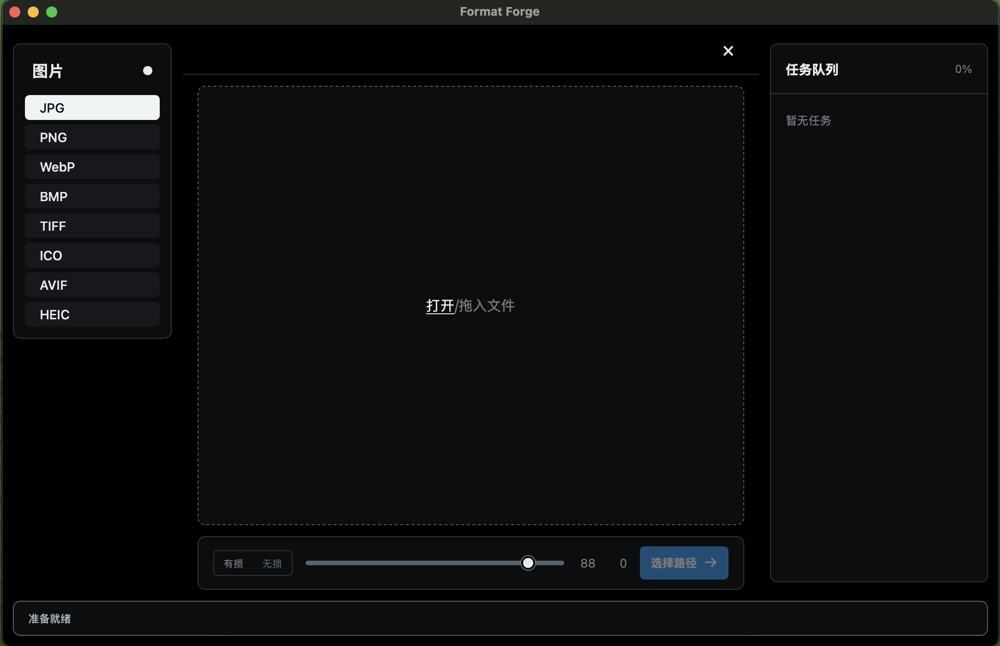

# Format Forge

离线、跨平台的图片与视频格式转换器。支持批量转换 JPG、PNG、WebP、BMP、TIFF、ICO、AVIF、SVG 和 iPhone 常用的 HEIC/HEIF；也可将 MP4、MOV、M4V、AVI、MKV、WebM 视频转换为 GIF。所有文件仅在本机处理，源文件不会被覆盖。



## 开发

前置条件：Node.js 22+、Rust stable 和平台对应的 Tauri 系统依赖。

```sh
npm install
npm run prepare:ffmpeg
npm run tauri dev
```

执行前端检查和 Rust 测试：

```sh
npm run check
source "$HOME/.cargo/env"
cargo test --manifest-path src-tauri/Cargo.toml
```

构建当前平台安装包：

```sh
npm run tauri build
```

## 架构

- `src/`：Tauri WebView 的 TypeScript 界面。只管理文件选择、导出设置和任务结果。
- `src-tauri/src/domain/`：转换格式、请求、结果和状态等稳定领域模型。
- `src-tauri/src/application/`：批处理用例、输出命名和原子写入编排。
- `src-tauri/src/infrastructure/`：具体图片编解码实现。新的文档、媒体或压缩格式转换器应在此层实现并通过应用层注册，而非写进 UI。

## 支持转换的文件格式

支持静态图片格式互转，包括图片转 GIF；也支持将 MP4、MOV、M4V、AVI、MKV、WebM 转换为 GIF。应用会根据所选文件自动判断转换方式：图片直接编码为 GIF，视频通过安装包内置的 [FFmpeg](https://ffmpeg.org/) 转换，无需在系统中安装或配置 `PATH`。视频 GIF 以 10 FPS 导出，最长边限制为 960px，以控制文件体积。

静态图片可导出为 SVG。导出时使用内置 VTracer 离线矢量化，生成包含真实 `<path>` 元素的 SVG，而不是嵌入原始位图。图标、Logo、插画和线稿通常效果最佳；照片会被近似为多个彩色路径，因此输出文件可能较大。导入 SVG 后可转换为任意支持的静态图片格式，渲染过程不会访问网络。GIF 和视频不能导出 SVG。

损坏、无法识别或无法写入的文件会在任务列表中显示失败原因。输出目录由用户选择，同名文件自动增加序号。

## 发布

GitHub Actions 会在 （macOS Intel暂无）、macOS Apple Silicon、Windows x64 与 Windows ARM64 上执行检查并构建 Tauri 安装包。正式分发前请在 GitHub 仓库 Secrets 中配置平台签名证书与 Tauri 更新签名密钥。# Tauri + Vanilla TS

This template should help get you started developing with Tauri in vanilla HTML, CSS and Typescript.

## Recommended IDE Setup

- [VS Code](https://code.visualstudio.com/) + [Tauri](https://marketplace.visualstudio.com/items?itemName=tauri-apps.tauri-vscode) + [rust-analyzer](https://marketplace.visualstudio.com/items?itemName=rust-lang.rust-analyzer)
